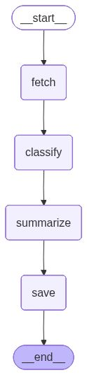

# Ticket Triaging Agent

An intelligent support ticket management system that automatically categorizes and prioritizes incoming support ticketsf


## Getting Started

**Prerequisites:**
- Make sure to have docker engine [installed](https://docs.docker.com/engine/install/)
- **NOTE:** This entire project was developed in a Ubuntu computer with RTX-3050


**Access the application:**
- Frontend: http://localhost:3000
- Backend API: http://localhost:8000
- API Documentation: http://localhost:8000/docs
- Database Admin: http://localhost:5050 (admin@traige.com / triage123456789)

## Architecture

### Tech Stack
- **Backend:** FastAPI, SQLAlchemy, LangGraph, PostgreSQL, Pydantic
- **Frontend:** React, TypeScript, Vite, ReactMarkdown
- **AI/ML:** OpenAI API, Ollama (local & Optional), Structured Output
- **Infrastructure:** Docker Compose, pgAdmin

### Workflow
1. **Ticket Ingestion** - Users create tickets via UI or JSON upload
2. **LangGraph Processing** - _Linear workflow_: Fetch → Classify → Summarize → Save

<div align="center">
  
</div>

---

### Database Schema
- **Tickets:** Ticket data with status tracking
- **AnalysisRun:** Batch analysis metadata and summaries
- **TicketAnalysis:** Ticket categorization results

## API Reference

### Ticket Management
- `POST /api/tickets/` - Create single or multiple tickets
- `GET /api/tickets/` - Retrieve all tickets with status

### Analysis Operations
- `POST /api/analysis/` - Trigger batch analysis of pending tickets
- `GET /api/analysis/latest` - Get most recent analysis results

## Configuration

### LLM Configuration
The system supports both cloud and local LLM options. Make sure to update your model and the baseUrl in the [config.py](backend/app/config.py)

**Default (Ollama):**
```python
MODEL = "gemma3"
API_URL = "http://host.docker.internal:11434/v1"
```

## Development

### 1. Local Development Setup
In two separate terminals, start the services as follows
```bash
# Backend
cd backend
python -m venv venv
source venv/bin/activate
pip install -r requirements.txt
uvicorn app.main:app --reload

# Frontend
cd frontend
npm install
npm run dev
```

### 2. Docker Compose (Recommended)
```bash
cd ticket-triaging-agent
cp .env.example .env # Add your API_KEYS 
docker compose up --build
```